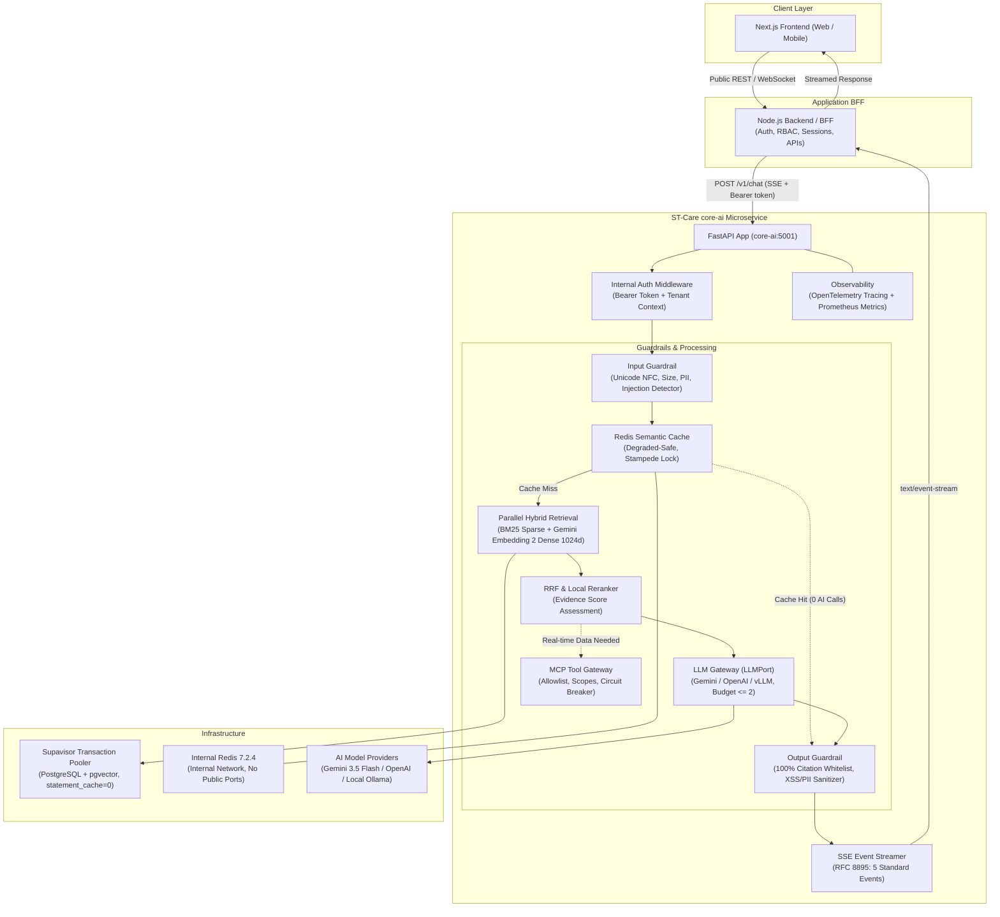

# ST-Care `core-ai` — Microservice Kiến trúc AI Trợ lý Sinh viên VNUA

> **Microservice Python độc lập** phụ trách toàn bộ pipeline RAG, LangGraph orchestration, LLM gateway đa provider, MCP tool gateway, semantic cache và ingestion tài liệu theo kiến trúc ST-Care VNUA.

## Trạng thái triển khai Completion Plan

Luồng production hiện tại là: input guardrail → L1 exact cache → query preparation
(một Gemini Embedding 2 dùng lại toàn luồng) → topic gate → L2 semantic cache → dense +
PostgreSQL FTS → RRF → BGE local → evidence gate → LLM/MCP/HITL → output guardrail.
Một câu trả lời chỉ trả tối đa 3 nguồn. Frontend hiển thị safe execution trace, không hiển
thị chain-of-thought.

Lịch học và học phí chỉ được đọc từ các bảng nghiệp vụ có RLS thông qua Node internal API.
Migration không tạo dữ liệu giả; trước khi bật hai tool này, chủ hệ thống phải nạp dữ liệu
authoritative và xác nhận mapping tài khoản sinh viên. Khi chưa có dữ liệu, tool trả
`not_found`/`unavailable` và chuyển fallback/HITL.

### Cài đặt sạch trên Windows

```powershell
Set-Location "D:\Group ST\st.support-vnua-react\core-ai"
Copy-Item .env.example .env

# Runtime + công cụ phát triển, không cài model local
uv sync --extra dev --frozen

# Chỉ khi cần Prompt Guard/BGE/ONNX local
uv sync --extra dev --extra local-models --extra onnx-models --frozen
```

Các tác vụ tương đương nằm trong `scripts/tasks.ps1`, ví dụ
`./scripts/tasks.ps1 install-models`, `./scripts/tasks.ps1 lint` và
`./scripts/tasks.ps1 compose`.

### Migration và publish dữ liệu

Áp dụng đúng thứ tự sau trên staging trước, rồi mới production:

1. `202609050001_support_cases.sql` — HITL support cases.
2. `202609050002_core_ai_completion.sql` — provenance, quality, knowledge version và topic anchors.
3. `202609050003_student_business_data.sql` — lịch học/học phí authoritative, không có seed giả.

Sau migration, chạy ingestion/re-embedding tài liệu đã duyệt, rồi tạo artifact local:

```powershell
uv run python scripts/seed_topic_anchors.py --tenant vnua
uv run python scripts/build_bm25_index.py --tenant vnua
```

Rollback an toàn là dừng ingestion, chuyển traffic về phiên bản ứng dụng cũ và khôi phục
snapshot DB tương ứng. Không drop cột/chunk/vector đang phục vụ khi chưa xác nhận phiên bản
knowledge cũ đã hoạt động. Ba migration này cố ý không chứa destructive down migration.

### Model local và ONNX INT8

Runtime tuyệt đối không tự tải/export model. Người vận hành thực hiện rõ ràng:

```powershell
uv run hf auth login
uv run python scripts/download_local_models.py prompt-guard reranker

# Export vào thư mục mới; manifest chứa revision và SHA-256 từng artifact
uv run python scripts/export_local_models.py `
  models/Llama-Prompt-Guard-2-86M models/Llama-Prompt-Guard-2-86M-onnx
uv run python scripts/export_local_models.py `
  models/bge-reranker-v2-m3 models/bge-reranker-v2-m3-onnx
```

Đổi `PROMPT_GUARD_MODEL_PATH`/`BGE_RERANKER_MODEL_PATH` sang thư mục ONNX sau khi quality
regression và benchmark đạt. Thứ tự fallback: ONNX INT8 → Transformers CPU → regex cho
Prompt Guard; ONNX INT8 → Transformers CPU → heuristic/RRF cho reranker.

### Monitoring

```powershell
docker compose config
docker compose --profile monitoring up -d --build
Invoke-RestMethod http://127.0.0.1:5001/health/ready
Invoke-WebRequest http://127.0.0.1:5001/metrics
```

Grafana chạy tại `http://localhost:3001`, Prometheus tại `http://localhost:9090` và dashboard
được provision tự động. `GRAFANA_ADMIN_PASSWORD`, `REDIS_PASSWORD`, service tokens và API key
phải được thay trước khi khởi chạy.

---

## 1. Tổng quan Kiến trúc Hệ thống

`core-ai` hoạt động như một microservice AI độc lập, không phụ thuộc và không can thiệp trực tiếp vào mã nguồn Node.js BFF hay Frontend hiện tại. Mọi giao tiếp giữa Node.js backend và `core-ai` diễn ra qua giao thức HTTP/SSE nội bộ có xác thực bằng `INTERNAL_SERVICE_TOKEN`.



---

## 2. Chi tiết các Thành phần Chính

### 2.1. API & Frozen Contracts (`src/core_ai/contracts/`)
Toàn bộ request/response schemas và typed events được đóng băng tại thư mục contracts:
- `contracts/chat.py`: `ChatRequest`, `ChatResponse`, `Citation`, `ExecutionTraceStep`, `FallbackInfo`, `RouteStatus`.
- `contracts/events.py`: 5 standard SSE event payloads theo chuẩn RFC 8895 (`request.accepted`, `pipeline.status`, `answer.delta`, `answer.completed`, `answer.error`).
- `contracts/llm.py`: `LLMPort` interface protocol, `GenerationRequest`, `GenerationResult`, `TokenUsage`.
- `contracts/mcp.py`: `MCPGateway` interface protocol, `ToolRequest`, `ToolResult`, `ToolScope`, `CircuitBreakerState`.
- `contracts/errors.py`: Hệ thống mã lỗi chuẩn hóa (`ErrorCode`) và exception hierarchy (`CoreAIError`).

### 2.2. LLM Gateway & Enforced Call Budget (`src/core_ai/llm/`)
- **Multi-Provider Abstraction**: Sử dụng LiteLLM adapter hỗ trợ chuyển đổi linh hoạt chỉ bằng cấu hình biến môi trường giữa:
  - Google Gemini (mặc định: `gemini-3.5-flash`).
  - OpenAI API (ví dụ: `gpt-4o`, `gpt-4o-mini`).
  - OpenAI-compatible endpoints (vLLM hoặc Ollama chạy Llama-3, Qwen local).
- **Enforced Call Budget**:
  - Trần tuyệt đối: **Tối đa 2 external AI calls** cho một request (kể cả retry và failover).
  - Normal RAG path: **2 external AI calls** — Gemini Embedding 2 cho query và Answer Generation.
  - Cache hit: Tiêu thụ đúng **0 external call**.
  - Không bao giờ gọi LLM lần thứ 3; nếu hết budget, chuyển sang verified fallback template hoặc HITL escalation.
- **Local Structured Output Repair**: Mọi output JSON sai cú pháp hoặc bị cắt ngắn đều được phân tích, sửa chữa cục bộ bằng regex/heuristic mà **không tốn thêm LLM call sửa JSON**.

### 2.3. MCP Tool Gateway (`src/core_ai/mcp/`)
- Tuân thủ official Python MCP SDK specification, hỗ trợ transport `streamable-http` và `stdio`.
- **Tool Allowlist & Scopes**:
  - `PUBLIC`: Mở cho toàn bộ người dùng (`search_knowledge`, `get_regulations`).
  - `AUTHENTICATED`: Bắt buộc có danh tính sinh viên `user_id` (`lookup_schedule`, `check_tuition`).
  - `ESCALATION`: Chỉ cho phép khi được chuyển cấp hỗ trợ cán bộ (`create_support_case`).
- **3-State Circuit Breaker**: Độc lập cho từng tool (`CLOSED` -> `OPEN` sau 3 lỗi liên tiếp -> `HALF_OPEN` sau 30s probe -> `CLOSED` sau 2 lần thành công).
- **Per-tool Timeout**: Giới hạn tối đa 3.0 giây cho mỗi lệnh gọi tool.

### 2.4. Data, Hybrid Retrieval & Semantic Cache (`src/core_ai/retrieval/`, `src/core_ai/data/`)
- **Supavisor Transaction Pooler**: `asyncpg` kết nối PostgreSQL với `statement_cache_size=0` bắt buộc; mọi query đều có điều kiện tenant isolation.
- **Hybrid Retrieval**: Chạy song song pgvector (Gemini Embedding 2, 1024 chiều, cosine similarity) và BM25 full-text search tiếng Việt.
- **RRF & Reranking**: Kết hợp qua thuật toán Reciprocal Rank Fusion (`k=60`) và local reranker đa tiêu chí để chọn lọc ra top 3-5 snippets có điểm bằng chứng cao nhất.
- **Semantic Cache trên Redis**: Key namespace `env:tenant:purpose:version:hash`.
- **Degraded-Safe Mode**: Nếu Redis dừng hoạt động hoặc timeout, hệ thống tự động đánh dấu `degraded`, bypass cache và tiếp tục pipeline retrieval an toàn mà không làm crash microservice.

### 2.5. Guardrails & An toàn Thông tin (`src/core_ai/guardrails/`)
- **Input Guardrail**: Chuẩn hóa Unicode NFC, loại bỏ ký tự vô hình/điều khiển, kiểm soát độ dài 1-4000 ký tự, chặn prompt injection/jailbreak song ngữ Anh - Việt, phát hiện và che giấu PII (CCCD 12 số, điện thoại, email, mật khẩu).
- **Output Guardrail**: Khử mã độc HTML/XSS, kiểm tra **100% Citation Whitelist** đối chiếu với các chunks được truy xuất từ retrieval; mọi citation ID không tồn tại hoặc bịa đặt đều bị chặn và loại bỏ khỏi nội dung phát cho sinh viên.
- **Zero Leakage**: Tuyệt đối không gửi raw system prompt, chain-of-thought, database credentials hay API keys trong SSE stream hay metadata.

### 2.6. Observability & Giám sát (`src/core_ai/observability/`, `monitoring/`)
- **OpenTelemetry Distributed Tracing**: Tạo trace spans an toàn (`trace_stage`), tự động lọc bỏ các thuộc tính chứa prompt hoặc PII (`FORBIDDEN_ATTRIBUTES`).
- **Prometheus Metrics Exporter**: Expose endpoint `/metrics` đo lường:
  - `core_ai_request_duration_seconds` (Histogram theo route, status, tenant).
  - `semantic_cache_hit_ratio` (Gauge tỉ lệ cache hit).
  - `core_ai_external_calls_total` (Counter cuộc gọi AI theo provider, model).
  - `core_ai_fallback_total` (Counter kích hoạt fallback theo lý do).
  - `core_ai_mcp_tool_duration_seconds` (Histogram thời gian chạy tool MCP).
  - `core_ai_redis_degraded_total` (Counter sự cố suy thoái Redis).

---

## 3. Bảng Cấu hình Biến Môi trường (`.env`)

### Local safety và reranking models (tùy chọn, có fallback)

Runtime không tự tải model. Nếu weights hoặc thư viện chưa có, Prompt Guard tự dùng regex;
reranker tự dùng heuristic và RRF. Để bật model local:

```powershell
Set-Location "D:\Group ST\st.support-vnua-react\core-ai"

# Cài đúng nhóm thư viện model local vào .venv
uv sync --extra local-models --extra dev --frozen

# Prompt Guard của Meta có thể yêu cầu chấp nhận license trên Hugging Face trước
uv run hf auth login

# Tải cả hai model vào core-ai/models (runtime chỉ đọc local)
uv run python scripts/download_local_models.py

# Hoặc tải riêng từng model
uv run python scripts/download_local_models.py prompt-guard
uv run python scripts/download_local_models.py reranker
```

Các model mặc định:

- `meta-llama/Llama-Prompt-Guard-2-86M`: classifier nhẹ cho prompt injection/jailbreak.
- `BAAI/bge-reranker-v2-m3`: cross-encoder đa ngôn ngữ; chất lượng tốt cho tiếng Việt nhưng weights khoảng 2.3 GB.

Sau khi tải xong, build lại container. Thư mục `models` được mount read-only:

```powershell
docker compose up -d --build
docker compose ps
Invoke-RestMethod http://127.0.0.1:5001/health/ready
```

`/health/ready` hiển thị model đang `ready` hay đang chạy fallback. Prometheus `/metrics`
có `core_ai_local_model_ready` và `core_ai_local_model_inference_seconds`.

### MCP minh bạch và HITL

Mỗi lần chạy tool xuất hiện trong SSE `pipeline.status` và `execution_trace` với tên tool,
trạng thái và latency; không hiển thị tham số nhạy cảm hoặc chain-of-thought.

| Tool | Scope | Nguồn | Fallback |
|---|---|---|---|
| `search_knowledge` | Public | PostgreSQL documents | RAG/fallback an toàn |
| `get_regulations` | Public | Kho tài liệu đã duyệt | Hỏi lại/chuyển cán bộ |
| `lookup_schedule` | Authenticated | Node business API | Circuit breaker/HITL |
| `check_tuition` | Authenticated | Node business API | Circuit breaker/HITL |
| `create_support_case` | Explicit approval | Node `support_cases` | Kênh liên hệ thủ công |

Áp dụng `supabase/migrations/202609050001_support_cases.sql` để tạo phiếu HITL thật.
`BUSINESS_API_TOKEN` trong Node `.env` và `core-ai/.env` phải giống nhau. UI luôn hỏi xác
nhận trước khi tạo phiếu; danh tính sinh viên chỉ lấy từ JWT do Node xác thực.

| Biến môi trường | Kiểu dữ liệu | Giá trị mặc định | Mô tả |
|---|---|---|---|
| `APP_ENV` | string | `development` | Môi trường triển khai: `development`, `staging`, `production`, `testing` |
| `CORE_AI_HOST` | string | `0.0.0.0` | Địa chỉ IP lắng nghe của FastAPI server |
| `CORE_AI_PORT` | integer | `5001` | Cổng HTTP của microservice |
| `REQUEST_DEADLINE_SECONDS` | number | `30` | Deadline tổng cho graph của một request |
| `INTERNAL_SERVICE_TOKEN` | string | `""` | Bearer token bí mật dùng để xác thực các request nội bộ từ Node.js BFF |
| `DEFAULT_TENANT` | string | `vnua` | Tenant mặc định của hệ thống |
| `ALLOWED_TENANTS` | string / list | `vnua` | Danh sách tenant được cấp quyền (ngăn chặn cross-tenant access) |
| `LLM_PROVIDER` | string | `gemini` | Nhà cung cấp model: `gemini`, `openai`, `openai_compatible` |
| `LLM_MODEL` | string | `gemini-3.5-flash` | Định danh model LLM chính |
| `LLM_API_KEY` | string | `""` | API Key cho LLM provider (inject qua secret manager) |
| `LLM_BASE_URL` | string | `None` | Endpoint tương thích OpenAI (dành cho vLLM, Ollama) |
| `LLM_TIMEOUT_SECONDS` | float | `20.0` | Thời gian chờ tối đa cho mỗi lượt gọi model |
| `LLM_MAX_EXTERNAL_CALLS`| integer | `2` | Trần số lượt gọi AI bên ngoài cho một request |
| `LLM_FALLBACK_PROVIDER` | string | `None` | Provider dự phòng khi provider chính gặp sự cố |
| `LLM_FALLBACK_MODEL` | string | `None` | Model dự phòng |
| `EMBEDDING_PROVIDER` | string | `gemini` | Nhà cung cấp vector nhúng qua Gemini API |
| `EMBEDDING_MODEL` | string | `gemini-embedding-2` | Model Gemini Embedding 2 ổn định |
| `EMBEDDING_DIMENSION` | integer | `1024` | Kích thước vector tương thích schema pgvector hiện tại |
| `EMBEDDING_API_KEY` | string | `""` | API key; cũng chấp nhận `GEMINI_API_KEY` hoặc `GOOGLE_API_KEY` |
| `EMBEDDING_BASE_URL` | string | Gemini API v1beta | Base URL của Gemini Developer API |
| `EMBEDDING_TIMEOUT_SECONDS` | number | `20` | Timeout mỗi request embedding |
| `EMBEDDING_MAX_CONCURRENCY` | integer | `5` | Số request embedding chạy đồng thời tối đa |
| `DATABASE_URL` | string | `postgresql://...` | DSN kết nối PostgreSQL Supabase qua Supavisor pooler |
| `DB_STATEMENT_CACHE_SIZE`| integer | `0` | Bắt buộc phải là `0` để tương thích Supavisor transaction mode |
| `DB_POOL_MIN_SIZE` | integer | `2` | Kích thước pool kết nối tối thiểu |
| `DB_POOL_MAX_SIZE` | integer | `10` | Kích thước pool kết nối tối đa |
| `REDIS_URL` | string | `redis://localhost:6379/0` | URL kết nối Redis nội bộ |
| `REDIS_MAX_CONNECTIONS` | integer | `30` | Giới hạn connection pool của Redis |
| `MCP_TRANSPORT` | string | `streamable-http` | Giao thức MCP: `streamable-http` hoặc `stdio` |
| `MCP_TOOL_TIMEOUT_SECONDS`| float | `3.0` | Timeout tối đa cho từng công cụ MCP |
| `MCP_ALLOWED_TOOLS` | string | `search_knowledge,...`| Danh sách tool được phép kích hoạt |
| `OTEL_SERVICE_NAME` | string | `st-care-core-ai` | Tên service đăng ký trong OpenTelemetry collector |
| `OTEL_EXPORTER_OTLP_ENDPOINT`| string | `None` | URL gửi telemetry gRPC/HTTP OTLP |
| `LOG_RAW_PROMPTS` | boolean | `false` | Bật/tắt ghi log prompt thô (mặc định tắt vì an toàn PII) |

---

## 4. Hướng dẫn Triển khai bằng Docker & Compose

### 4.1. Cấu trúc Triển khai
Hệ thống bao gồm file `Dockerfile` tối ưu hóa nhiều tầng (multi-stage build) và `compose.yaml` tích hợp sẵn Redis nội bộ chạy trong network độc lập:
- Redis image được pin version: `redis:7.2.4-alpine`.
- Không map cổng Redis ra ngoài máy chủ host ở production (`expose: 6379`).
- Có cấu hình kiểm tra sức khỏe `healthcheck` tự động cho cả Redis và `core-ai`.

### 4.2. Khởi chạy Dịch vụ

```bash
# 1. Di chuyển vào thư mục service
cd core-ai

# 2. Tạo file cấu hình môi trường từ mẫu
cp .env.example .env
# Chỉnh sửa INTERNAL_SERVICE_TOKEN và các thông tin cấu hình cần thiết trong .env

# 3. Khởi chạy core-ai và Redis nội bộ
docker compose up -d --build

# 4. Kiểm tra trạng thái containers và healthcheck
docker compose ps
```

### 4.3. Khởi chạy Kèm Giám sát Prometheus (Tùy chọn)

```bash
# Khởi chạy kèm profile monitoring
docker compose --profile monitoring up -d

# Truy cập dashboard Prometheus: http://localhost:9090
```

### 4.4. Kiểm tra Endpoint Healthcheck

```bash
# Liveness probe (kiểm tra tiến trình sống)
curl -i http://localhost:5001/health/live

# Readiness probe (kiểm tra kết nối DB và Redis)
curl -i http://localhost:5001/health/ready
```

---

## 5. Hướng dẫn Kiểm thử Toàn diện (Manual Testing Guide)

Toàn bộ test suite được thiết kế **độc lập 100% với các dịch vụ bên ngoài** (sử dụng in-memory mocks cho Redis, asyncpg, LiteLLM, và MCP). Người dùng có thể chủ động chạy toàn bộ hoặc từng nhóm test độc lập bằng `pytest`.

### 5.1. Cài đặt Môi trường Test Cục bộ

```bash
cd core-ai

# Khuyến nghị dùng môi trường ảo Python 3.11+
python -m venv .venv
# Trên Linux/macOS:
source .venv/bin/activate
# Trên Windows PowerShell:
.venv\Scripts\Activate.ps1

# Cài đặt dependencies bao gồm nhóm dev
pip install -e ".[dev]"
```

### 5.2. Các Lệnh Chạy Test theo Nhóm

```bash
# 1. Chạy toàn bộ 8 nhóm kiểm thử
pytest tests/ -v

# 2. Chạy nhóm Unit Tests (RRF, Reranker, Cache Key, Parser, Guardrails)
pytest tests/unit/ -v

# 3. Chạy nhóm Contract Tests (Pydantic models, SSE events, Error codes)
pytest tests/contract/ -v

# 4. Chạy nhóm Retrieval Tests (Hybrid search merge, Tenant isolation)
pytest tests/retrieval/ -v

# 5. Chạy nhóm LLM Tests (Provider abstraction, 2-call budget enforcement)
pytest tests/llm/ -v

# 6. Chạy nhóm MCP Tests (Tool registry, Allowlist, 3-state Circuit Breaker)
pytest tests/mcp/ -v

# 7. Chạy nhóm Resilience Tests (Redis outage degraded mode, LLM failover)
pytest tests/resilience/ -v

# 8. Chạy nhóm Security Tests (Prompt injection, Citation spoof, PII sanitization)
pytest tests/security/ -v

# 9. Chạy nhóm E2E Flow Tests (SSE chat streaming flow, Cache hit zero-call flow)
pytest tests/e2e/ -v

# 10. Chạy kiểm tra độ bao phủ mã nguồn (Code Coverage)
pytest tests/ --cov=src/core_ai --cov-report=term-missing
```

---

## 6. Tài liệu Đặc tả API (API Reference)

### 6.1. Endpoint Streaming Trò chuyện (`POST /v1/chat`)

- **URL**: `POST /v1/chat`
- **Headers**:
  - `Content-Type: application/json`
  - `Authorization: Bearer <INTERNAL_SERVICE_TOKEN>`
  - `X-Request-ID: <uuid>`
  - `X-Tenant-ID: vnua`
  - `X-User-ID: <trusted-user-id>` (nếu người dùng đã đăng nhập)
- Các trường identity trong body (nếu client cũ còn gửi) bị bỏ qua; chỉ header từ BFF đã xác thực được tin cậy.
- **Request Body**:

```json
{
  "conversation_id": "c73bcdcc-1234-4567-89ab-cdef01234567",
  "message": "Sinh viên đại học chính quy được đăng ký tối đa bao nhiêu tín chỉ một học kỳ?",
  "locale": "vi-VN",
  "channel": "web"
}
```

- **Response Type**: `text/event-stream`
- **Trình tự các sự kiện SSE phát ra**:

```text
event: request.accepted
data: {"request_id":"9b1deb4d-3b7d-4bad-9bdd-2b0d7b3dcb6d","conversation_id":"c73bcdcc-1234-4567-89ab-cdef01234567","timestamp":"2026-09-04T14:30:00.100Z","status":"accepted"}

event: pipeline.status
data: {"request_id":"9b1deb4d-3b7d-4bad-9bdd-2b0d7b3dcb6d","stage":"retrieval","status":"in_progress","message":"Đang tìm kiếm tài liệu","message_vi":"Đang tìm kiếm tài liệu","progress_percent":50}

event: answer.delta
data: {"request_id":"9b1deb4d-3b7d-4bad-9bdd-2b0d7b3dcb6d","delta":"Theo Quy chế đào tạo ","index":0}

event: answer.delta
data: {"request_id":"9b1deb4d-3b7d-4bad-9bdd-2b0d7b3dcb6d","delta":"đại học của VNUA [src_1], ","index":1}

event: answer.completed
data: {
  "request_id": "9b1deb4d-3b7d-4bad-9bdd-2b0d7b3dcb6d",
  "conversation_id": "c73bcdcc-1234-4567-89ab-cdef01234567",
  "status": "answered",
  "answer": "Theo Quy chế đào tạo đại học của VNUA [src_1], trong mỗi học kỳ chính, sinh viên được đăng ký tối đa 24 tín chỉ và tối thiểu 14 tín chỉ (trừ học kỳ cuối khóa).",
  "confidence": 0.94,
  "citations": [
    {
      "citation_id": "src_1",
      "document_id": 101,
      "title": "Quy chế đào tạo đại học chính quy VNUA",
      "page": 14,
      "snippet": "Sinh viên được phép đăng ký tối đa 24 tín chỉ trong một học kỳ chính.",
      "relevance_score": 0.92
    }
  ],
  "execution_trace": [
    {"step": "input_guardrail", "status": "passed", "latency_ms": 12},
    {"step": "semantic_cache", "status": "completed", "latency_ms": 18},
    {"step": "retrieval", "status": "completed", "latency_ms": 85},
    {"step": "generation", "status": "completed", "latency_ms": 620},
    {"step": "output_guardrail", "status": "passed", "latency_ms": 25}
  ],
  "fallback": null,
  "latency_ms": 780,
  "usage": {
    "prompt_tokens": 120,
    "completion_tokens": 45,
    "total_tokens": 165,
    "external_calls_count": 2
  }
}
```

### 6.2. Endpoint Tương thích Ngược Legacy (`POST /ask-ai`)

- **URL**: `POST /ask-ai`
- **Request Body**:
```json
{
  "question": "Học phí một tín chỉ là bao nhiêu?",
  "conversation_id": "legacy-conv-uuid",
  "tenant_id": "vnua"
}
```
- **Response**: Trả về JSON hoàn chỉnh `{"answer": "...", "status": "answered", "sources": [...]}` tương thích với frontend hiện hữu.

### 6.3. Endpoint Prometheus Metrics (`GET /metrics`)
- **URL**: `GET /metrics`
- **Output**: Định dạng chuẩn của Prometheus Text Exporter phục vụ thu thập dữ liệu bởi hệ thống giám sát.

### 6.4. Tạo phiếu hỗ trợ có xác nhận

BFF gửi `requested_tool="create_support_case"`, `tool_approved=true` và `tool_arguments` sau khi người dùng xác nhận. Request bắt buộc có `X-User-ID`; `student_id` trong body không được dùng làm danh tính. Khi API nghiệp vụ tạo phiếu thành công, response có `status="escalated"`, `fallback.ticket_id` và dùng 0 external AI call. Nếu chưa xác nhận hoặc tool lỗi, hệ thống không tạo phiếu giả.

---

## 7. Nguyên tắc An toàn & Cơ chế Phòng thủ

1. **Bảo vệ Thông tin Định danh (PII)**: Toàn bộ số CCCD, điện thoại, email cá nhân và mật khẩu đều được phát hiện và che giấu tự động tại Input Guardrail và Output Guardrail. Traces và logs tuyệt đối không ghi nhận dữ liệu nhạy cảm.
2. **Ngăn chặn Suy đoán (Hallucination)**: Mọi câu trả lời liên quan đến quy định, học phí, lịch học bắt buộc phải có trích dẫn nguồn (`citations`). Nếu điểm bằng chứng (`evidence_score`) thấp hơn `0.55`, hệ thống từ chối trả lời tự suy diễn và kích hoạt hỏi lại hoặc chuyển tiếp hỗ trợ cán bộ (HITL).
3. **Chống Chiếm quyền Điều khiển (Prompt Injection)**: Bộ nhận diện song ngữ quét và ngăn chặn ngay lập tức các câu lệnh yêu cầu tiết lộ system prompt, vượt qua bộ lọc hoặc đổi nhân vật.
4. **Phòng thủ Tắc nghẽn Hạ tầng**: Circuit Breaker tự động ngắt kết nối với các công cụ MCP bị lỗi hoặc timeout quá 3 giây. Redis degraded-safe đảm bảo nếu cache gặp sự cố thì hệ thống vẫn phục vụ bình thường từ cơ sở dữ liệu.

---

## 8. Migration và tái tạo vector Gemini Embedding 2

Migration mới xóa giá trị vector cũ vì vector từ hai model khác nhau không được phép so sánh trong cùng không gian. Thứ tự người vận hành tự chạy:

```powershell
# 1. Áp dụng migration theo quy trình Supabase của dự án
# supabase/migrations/202609040001_core_ai_tenant_isolation.sql

# 2. Từ thư mục core-ai, tái tạo toàn bộ vector theo từng tenant
uv run python scripts/reembed_existing.py --tenant vnua --batch-size 50

# 3. Chỉ đưa service vào traffic sau khi documents về trạng thái ready
```

Script sử dụng `gemini-embedding-2`, 1024 chiều và cần `GOOGLE_API_KEY` (hoặc `GEMINI_API_KEY`/`EMBEDDING_API_KEY`). Không chạy script trước migration.

## 9. Tích hợp API nghiệp vụ

Các tool `lookup_schedule`, `check_tuition` và `create_support_case` không dùng dữ liệu giả. Chúng fail-closed cho đến khi Phase 4 cấu hình `BUSINESS_API_BASE_URL` và `BUSINESS_API_TOKEN`, đồng thời Node cung cấp các endpoint `/internal/v1/...` tương ứng. `search_knowledge` và `get_regulations` đọc trực tiếp kho tài liệu tenant-safe.

## 10. Rollback an toàn

- Nếu Gemini Embedding 2 lỗi, dừng traffic tới bản mới và khôi phục image ứng dụng trước đó; không trộn vector cũ với vector mới.
- Migration chủ động đặt vector cũ thành `NULL`, vì vậy rollback dữ liệu cần khôi phục từ backup/snapshot trước migration hoặc chạy lại pipeline embedding của model cũ trên schema tương ứng.
- Redis chỉ là cache/idempotency; có thể dừng Redis và service tiếp tục ở degraded mode. Không dùng thao tác xóa DB để rollback cache.
- Nếu API nghiệp vụ Node chưa sẵn sàng, để trống cấu hình business API; tool sẽ trả lỗi có kiểm soát thay vì tạo dữ liệu giả.
